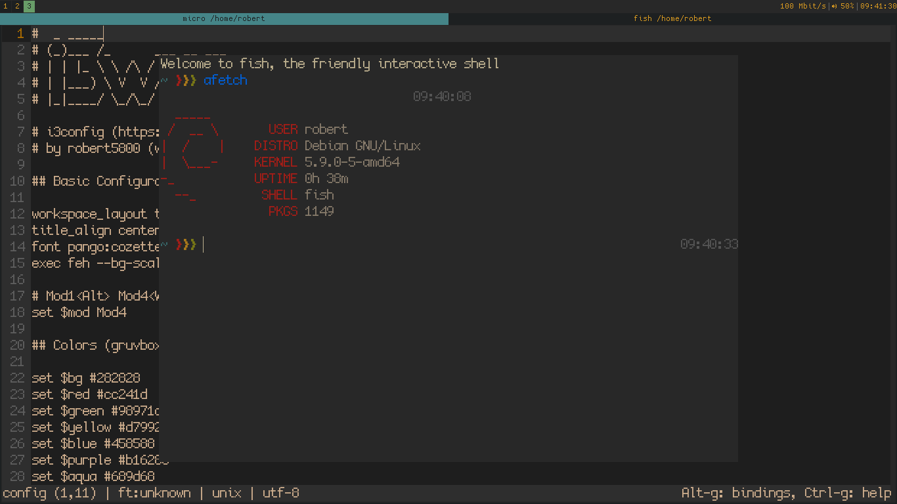

# dotfiles
My personal dotfiles (work in progress)

## Features

### i3wm
- Gruvbox color scheme
- Tabbed layout (for small screens)
- De-cluttered i3bar
  - Time, volume, internet speed
  - Scroll on the bar to change screen brightness
- Reduced & simplified keybindings
- Working multimedia keys (sound & brightness)
  - Sound volume: ``mod+Down/Up/Delete (mute)``
  - Screen brightness: ``mod+Left/Right``
- Take screenshots with ``Printscreen``
### Screenshot


## Requirements
- i3wm
  - font-awesome (for icons)
  - pulseaudio + pavucontrol (volumecontrol)
  - scrot (screenshot utility)
  - feh (wallpaper utility)

## Installation
 Debian
 ```
 sudo apt install i3 fonts-font-awesome pulseaudio pavucontrol brightnessctl scrot
 ```

 Arch
 ```
 sudo pacman -S i3 ttf-font-awesome pulseaudio pavucontrol brightnessctl scrot
 ```
